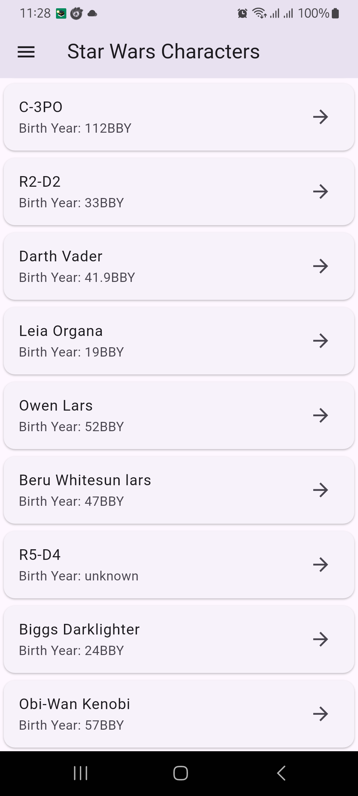
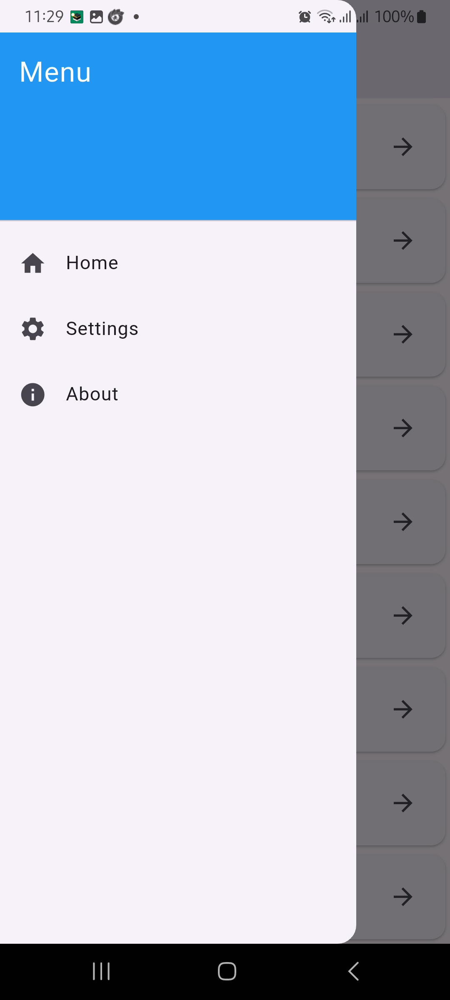
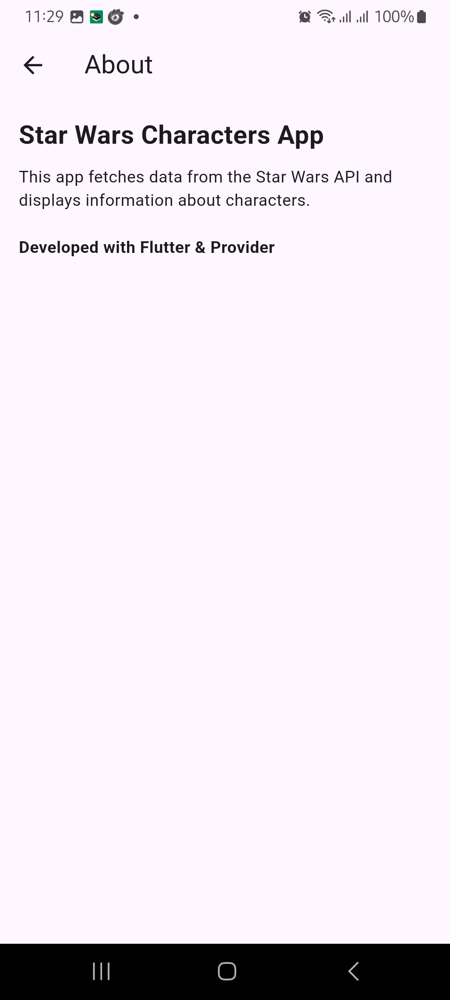
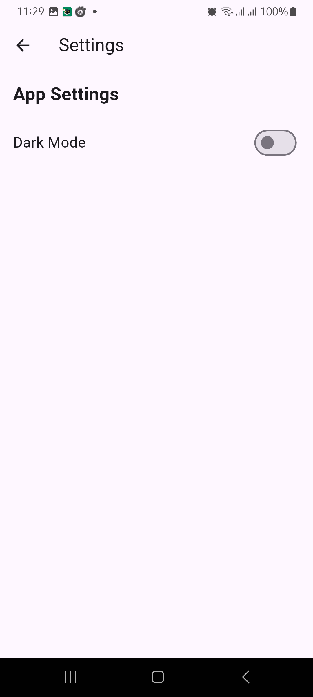
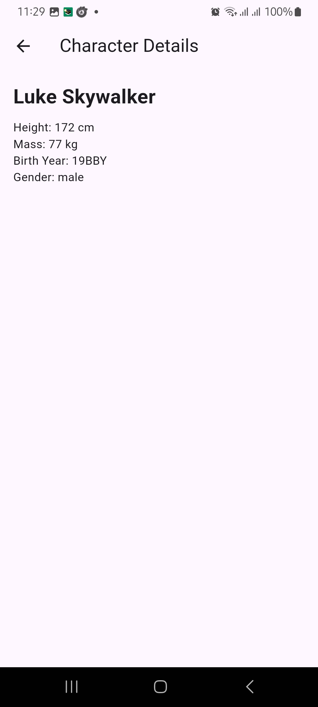

Here's your README.md file for the Star Wars Character Explorer app in a similar format:

md
Copy
Edit
# 🌌 Star Wars Character Explorer

## 📌 Overview
The **Star Wars Character Explorer** is a Flutter-based mobile application that fetches and displays data from the **Star Wars API (SWAPI)**. Users can search for characters, view details, and navigate the app using a side drawer.

## 🚀 Features
- 🏠 **Side Navigation Drawer** – Includes sections like Home and About.  
- 🔎 **Search Bar** – Users can search for Star Wars characters by name.  
- 📜 **Character List with Pagination** – Displays characters with infinite scrolling.  
- 🎭 **Character Details Page** – Shows detailed character information.
- ⚙️ **State Management** – Uses `Provider` for efficient state handling.  

## 🖥 Tech Stack
- **Frontend:** Flutter, Dart  
- **Backend:** SWAPI (Star Wars API)  
- **State Management:** Provider  
- **Networking:** Dio,https (for API requests)  
- **Storage:** Shared Preferences (for saving theme preferences)  

## 📸 Screenshots

### 🏠 Home Screen  
  

### 🔎 Search Feature  
  

### 🎭 Character Details  
  

### 🌗 Dark Mode  
  

### ⚙️ Settings Page  
  

## 🛠 Setup & Installation
1. Clone the repository:  
   ```sh
   git clone https://github.com/sbfrusho/star-war-character.git
   cd star-war-character
Install dependencies:
sh
Copy
Edit
flutter pub get
Run the app:
sh
Copy
Edit
flutter run
💡 Challenges & Solutions
🌀 Implementing Pagination
Issue: Fetching and displaying all characters dynamically.
Solution: Used infinite scroll with API pagination (?page=1, ?page=2, etc.).
🌗 Persisting Theme Preferences
Issue: Theme resets after app restart.
Solution: Implemented SharedPreferences to save user preferences.
🔄 Navigation Issues
Issue: "Back" button caused black screen due to incorrect navigation stack handling.
Solution: Fixed navigation using GoRouter with safe pop handling.
📄 License
This project is open-source under the MIT License.

👨‍💻 Author
Developed by Sakib Bin Faruque Rusho

📧 Contact: rushocseru28@gmail.com

🔗 GitHub: sbfrusho

Feel free to contribute and report any issues! 🚀
